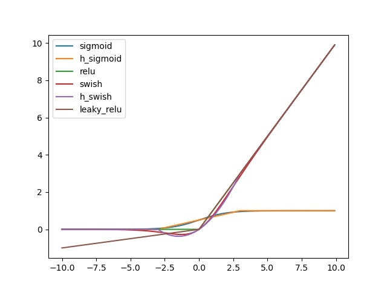
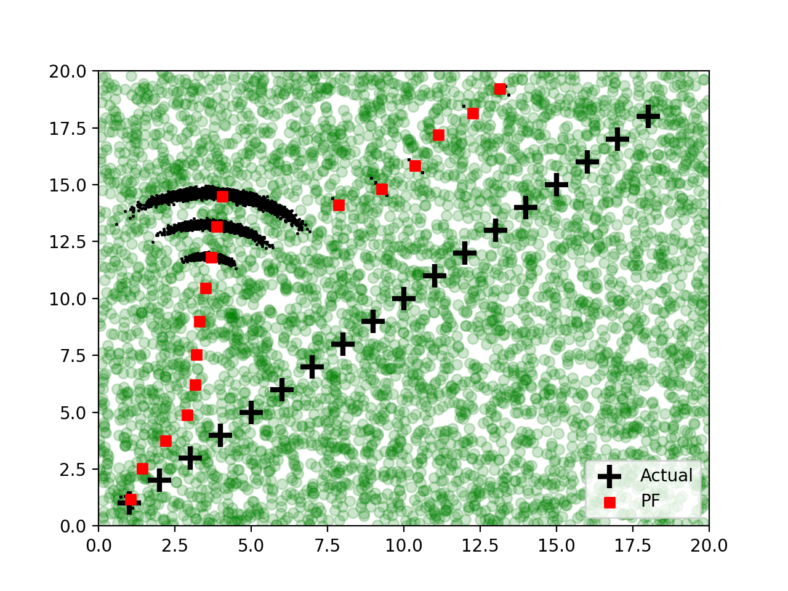

# UtilsTools

### 1. The commonly used basic functions for CNNs and other modules.

  ####  Comparison of the listed 6 activation functions.

   Include sigmoid, h-sigmoid, ReLU, swish, h-swish, LeakyReLU.


   | Activation function | Mathematics Expression |
   | ------------------- | ---------------------- |
   | Sigmoid             | 1/(1+exp(-x))          |
   | H-sigmoid           | ReLU6(x+3)/6           |
   | ReLU                | Max(x, 0)              |
   | Swish               | x*1/(1+exp(-x))        |
   | H-Swish             | x*ReLU6(x+3)/6         |
   |LeakyReLU            | Max(0, x)+slope*Min(0, x)|
   

### 



### 2. Vision Transformer.
We split the ViT into 7 basic modules. Here are the basic blocks/modules of ViT.
```python 

class PositionEmbedding(nn.Module)

class MLPBlock(nn.Module)

class MatrixGeneral(nn.Module)

class MultiHeadSelfAttention(nn.Module)

class EncoderBasicBlock(nn.Module)

class TransformerEncoder(nn.Module)

class VisionTransformerRebuild(nn.Module)

```

We print the statistical information of Vision Transformer.


```python
if __name__ == '__main__':
    model = VisionTransformerRebuild(num_layers=2)
    x = torch.randn((2, 3, 256, 256))
    out = model(x)

    state_dict = model.state_dict()

    for key, value in state_dict.items():
        print("{}: {}".format(key, value.shape))
```

Here are the output of each blocks. The shape of weights and bias are listed below.

```python
cls_token: torch.Size([1, 1, 768])
embedding.weight: torch.Size([768, 3, 16, 16])
embedding.bias: torch.Size([768])
transformer.pos_embedding.pos_embedding: torch.Size([1, 257, 768])
transformer.encoder_layers.0.layer_norm1.weight: torch.Size([768])
transformer.encoder_layers.0.layer_norm1.bias: torch.Size([768])
transformer.encoder_layers.0.multi_head_att.query.weight: torch.Size([768, 12, 64])
transformer.encoder_layers.0.multi_head_att.query.bias: torch.Size([12, 64])
transformer.encoder_layers.0.multi_head_att.key.weight: torch.Size([768, 12, 64])
transformer.encoder_layers.0.multi_head_att.key.bias: torch.Size([12, 64])
transformer.encoder_layers.0.multi_head_att.value.weight: torch.Size([768, 12, 64])
transformer.encoder_layers.0.multi_head_att.value.bias: torch.Size([12, 64])
transformer.encoder_layers.0.multi_head_att.out.weight: torch.Size([12, 64, 768])
transformer.encoder_layers.0.multi_head_att.out.bias: torch.Size([768])
transformer.encoder_layers.0.layer_norm2.weight: torch.Size([768])
transformer.encoder_layers.0.layer_norm2.bias: torch.Size([768])
transformer.encoder_layers.0.mlp.fc1.weight: torch.Size([3072, 768])
transformer.encoder_layers.0.mlp.fc1.bias: torch.Size([3072])
transformer.encoder_layers.0.mlp.fc2.weight: torch.Size([768, 3072])
transformer.encoder_layers.0.mlp.fc2.bias: torch.Size([768])
transformer.encoder_layers.1.layer_norm1.weight: torch.Size([768])
transformer.encoder_layers.1.layer_norm1.bias: torch.Size([768])
transformer.encoder_layers.1.multi_head_att.query.weight: torch.Size([768, 12, 64])
transformer.encoder_layers.1.multi_head_att.query.bias: torch.Size([12, 64])
transformer.encoder_layers.1.multi_head_att.key.weight: torch.Size([768, 12, 64])
transformer.encoder_layers.1.multi_head_att.key.bias: torch.Size([12, 64])
transformer.encoder_layers.1.multi_head_att.value.weight: torch.Size([768, 12, 64])
transformer.encoder_layers.1.multi_head_att.value.bias: torch.Size([12, 64])
transformer.encoder_layers.1.multi_head_att.out.weight: torch.Size([12, 64, 768])
transformer.encoder_layers.1.multi_head_att.out.bias: torch.Size([768])
transformer.encoder_layers.1.layer_norm2.weight: torch.Size([768])
transformer.encoder_layers.1.layer_norm2.bias: torch.Size([768])
transformer.encoder_layers.1.mlp.fc1.weight: torch.Size([3072, 768])
transformer.encoder_layers.1.mlp.fc1.bias: torch.Size([3072])
transformer.encoder_layers.1.mlp.fc2.weight: torch.Size([768, 3072])
transformer.encoder_layers.1.mlp.fc2.bias: torch.Size([768])
transformer.norm.weight: torch.Size([768])
transformer.norm.bias: torch.Size([768])
classifier.weight: torch.Size([1000, 768])
classifier.bias: torch.Size([1000])
```


### 3. Particle Filter.

#### Unnormalization weights when resampling. 
After each iteration/resampling, we should set the weights with average distribution. If not normalization, the effect is shown in below 👇 ⬇️.


#### Normalization weights when resampling. 
After each iteration/resampling, we should set the weights with average distribution. 'weights=1/num_weights'. After reset sampling weights, effect is this👇 ⬇️.


### References 
[Kalman-and-Bayesian-Filters-in-Python: Particle filter](https://nbviewer.org/github/rlabbe/Kalman-and-Bayesian-Filters-in-Python/blob/master/12-Particle-Filters.ipynb)

[UCB lecture: PF](https://people.eecs.berkeley.edu/~pabbeel/cs287-fa15/slides/lecture23-particle-filters.pdf)

[Particle Filter Explained With Python Code From Scratch](https://ros-developer.com/2019/04/10/parcticle-filter-explained-with-python-code-from-scratch/)
